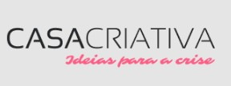
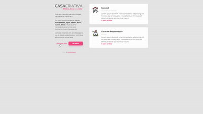

<h1 align="center">
    
</h1>

<h1 align="center">
    
</h1>


## Indice
- [Sobre](#-sobre)
- [Tecnologias Utilizadas](#-tecnologias-utilizadas)
- [Como baixar o projeto](#-como-baixar-o-projeto)

---

## 🔖 Sobre

O projeto **Casa Criativa** é uma plataforma para cadastro de ideias que possam ajudar as pessoas a encontrar formas criativas de superarem a crise, de brincadeiras até cursos. O site foi criado na **WorkshopDev Especial** da Rocketseat, um workshop que procurou ensinar a criar um site do zero utilizando ferramentas de Front-end e Back-end.

---

## 🚀 Tecnologias Utilizadas

- HTML5
- CSS3
- JavaScript
- Node.js
- Express
- Nunjucks
- SQL

---

## 💻 Como baixar o projeto

```bash

# clonar o repositório
$ git clone https://github.com/ThiagoPederzolli/workshopdev

#entrar no respositório
$ cd workshopdev

#instalar as dependências
$ npm install express

#instalar o nunjucks
$ npm install nunjucks

```

---

Desenvolvido por © Thiago Pederzolli Machado da Silva